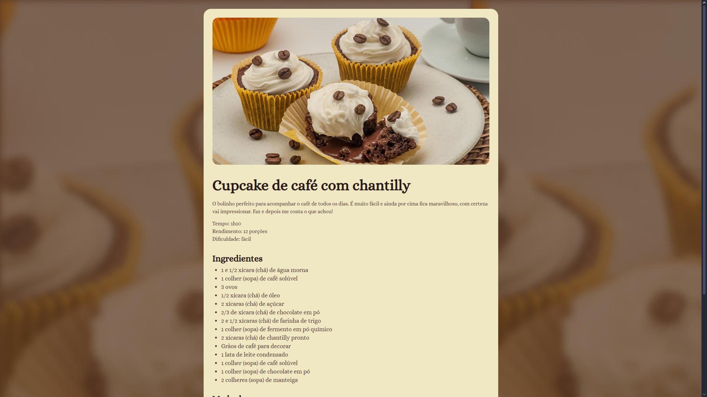

# 🍰 Página de Receita - Cupcake de Café com Chantilly

Este é um projeto simples de uma página de receita, desenvolvido com **HTML** e **CSS**, apresentando um layout elegante e responsivo.

## 🖼️ Prévia do Projeto

[Visite a Página de Receita](https://ViniciusDSDSouza.github.io/pagina-receita/index.html)

## 🚀 Tecnologias Utilizadas

- **HTML5**
- **CSS3**
- **Google Fonts**
